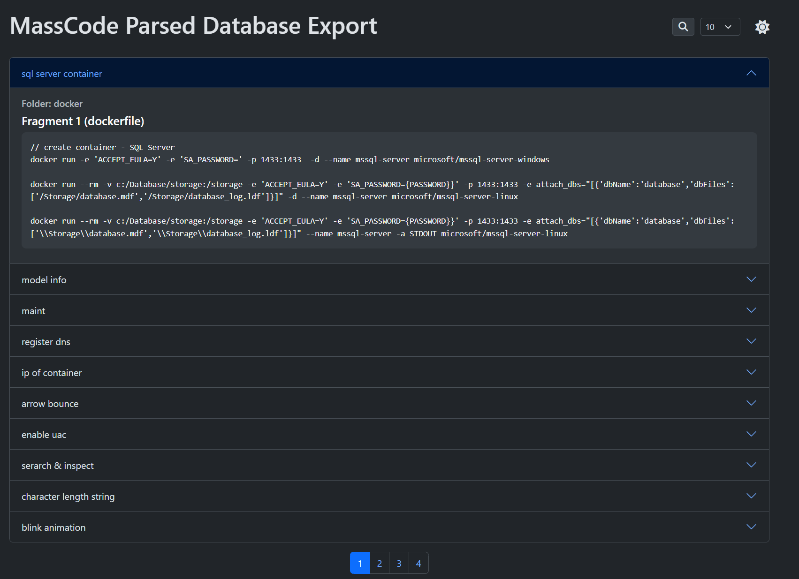

# MassCode Parser

[](https://github.com/ondrovic/mass-code-parser/actions/workflows/testing.yml)
[](https://github.com/ondrovic/mass-code-parser/actions/workflows/releaser.yml)


`mass-code-parser` is a command-line tool for parsing and exporting MassCode database files into various formats. This tool allows users to convert their MassCode database into text, HTML, or JSON files.

## Features

- Parse MassCode database files (`db.json`).
- Export the parsed data into text, HTML, or JSON formats.
- Support for specifying output file paths and types.

## Requirements

- Go 1.23 or later
- [MassCode](https://masscode.io/) database file (`db.json`)

## Installation

1. Clone the repository:

   ```bash
   git clone https://github.com/ondrovic/mass-code-parser.git
   ```

2. Navigate to the project directory:

   ```bash
   cd mass-code-parser
   ```

3. Build the project:

   ```bash
   go build -o mass-code-parser ./cmd
   ```

## Usage

```bash
mass-code-parser <path-to-db.json> [flags]
```

### Example

To parse a MassCode database file located at `/path/to/db.json` and export the results as an HTML file:

```bash
mass-code-parser /path/to/db.json --output --output-path="/path/to/output" --output-type="html"
```



### Flags

- `-o, --output` (boolean): Export results to a file.
- `-p, --output-path` (string): Specify the path for the output file (without extension).
- `-t, --output-type` (string): Specify the output type. Options are `text`, `html`, or `json`. Default is `html`.

### Command-Line Options

- **`-o, --output`**: If provided, the output will be saved to a file instead of printed to the console.
- **`-p, --output-path`**: Path for the output file (without extension). If not specified, defaults to `mass_code_export`.
- **`-t, --output-type`**: Specifies the output format. Valid options are:
  - `text`: Export as a plain text file.
  - `html`: Export as an HTML file.
  - `json`: Export as a JSON file.

### Exit Codes

- `0`: Successful execution.
- `1`: Execution failed due to an error.

## Contributing

Contributions are welcome! Please fork the repository and submit a pull request for any improvements or fixes.

## License

This project is licensed under the MIT License. See the [LICENSE](LICENSE) file for details.

## Acknowledgments

This tool utilizes several Go libraries, including:

- [spf13/cobra](https://github.com/spf13/cobra): A library for creating powerful modern CLI applications.
- [spf13/viper](https://github.com/spf13/viper): A complete configuration solution for Go applications.
- [ondrovic/common](https://github.com/ondrovic/common): Common utilities for Go applications.
